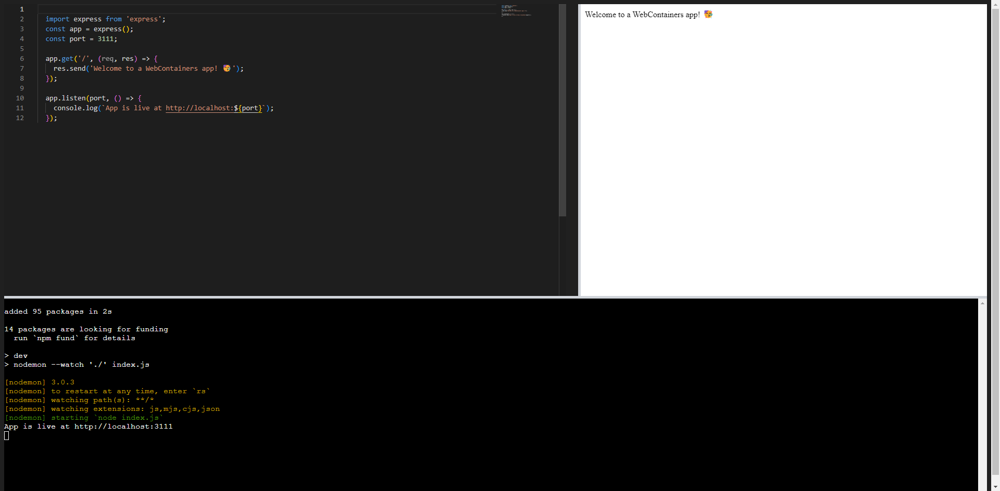

# WebContainers App



## Description

This application is an interactive IDE built with React, WebContainers API, React Resizable Layout, Monaco Editor, and Xterm. It provides a complete development environment in the browser, allowing users to write, compile, and execute code efficiently.

## Key Features

- **WebContainers API**: Utilize the WebContainers API to run code in isolated and secure environments directly in the browser.
- **React Resizable Layout**: Offers a flexible and customizable user interface, allowing users to adjust and organize the layout according to their preferences.
- **Monaco Editor**: Provides a powerful and highly customizable code editor with support for multiple languages and syntax highlighting.
- **Xterm Terminal**: Incorporates an interactive terminal that allows users to execute commands and view real-time output.
- **Zustand State Management**: Lightweight and efficient state management for editor storage.
- **TypeScript**: Fully typed codebase for enhanced safety and maintainability.

## Technologies Used

### Core Dependencies

- **React** `^18.3.1` - UI library
- **@webcontainer/api** `^1.6.1` - API to run Node.js in the browser
- **@monaco-editor/react** `^4.7.0` - VS Code-based code editor
- **xterm** `^5.3.0` - Terminal emulator
- **react-resizable-layout** `^0.7.2` - Resizable layout components
- **zustand** `^5.0.8` - State management

### Development Dependencies

- **TypeScript** `^5.9.3` - Static typing
- **Vite** `^5.4.11` - Build tool and dev server
- **ESLint** `^8.57.1` - Code linter
- **@typescript-eslint** `^8.48.0` - ESLint rules for TypeScript

## Prerequisites

- Node.js (version 18 or higher recommended)
- pnpm (recommended package manager) or npm

## Installation

1. **Clone the repository:**
   ```bash
   git clone https://github.com/jairayafranco/webcontainer-app.git
   cd webcontainer-app
   ```

2. **Install dependencies:**
   
   Using pnpm (recommended):
   ```bash
   pnpm install
   ```
   
   Or using npm:
   ```bash
   npm install
   ```

3. **Start the development server:**
   ```bash
   pnpm dev
   ```
   
   Or using npm:
   ```bash
   npm run dev
   ```

4. **Access the application:**
   Open your browser at `http://localhost:5173/`

## Available Scripts

- `pnpm dev` - Start the development server
- `pnpm build` - Build the application for production
- `pnpm preview` - Preview the production build
- `pnpm lint` - Run the linter to check code quality

## Project Structure

```
webcontainer-app/
├── public/                 # Static files
├── src/
│   ├── components/         # React components
│   │   ├── Editor.tsx      # Monaco editor
│   │   ├── Ide.tsx         # Main IDE component
│   │   ├── Output.tsx      # Output panel (iframe)
│   │   ├── Terminal.tsx    # Interactive terminal
│   │   └── SampleSplitter.tsx  # Resizable divider
│   ├── store/              # State management
│   │   └── useEditorStore.ts
│   ├── styles/             # CSS styles
│   ├── utils/              # Utilities
│   └── main.tsx            # Entry point
├── package.json
├── tsconfig.json           # TypeScript configuration
├── vite.config.ts          # Vite configuration
└── README.md
```

## Usage

1. **Code Editor (Left Panel)**: Write your JavaScript/TypeScript code in the Monaco editor.

2. **Output Panel (Right Panel)**: Displays the running application inside an iframe when the server is ready.

3. **Terminal (Bottom Panel)**: Execute commands, install packages, and view real-time output. The terminal is connected to the WebContainer.

4. **Resize Panels**: Drag the dividers to adjust panel sizes according to your preferences.

## IDE Features

- ✅ Node.js code execution in the browser
- ✅ Automatic hot reload
- ✅ Full interactive terminal
- ✅ Editor with syntax highlighting
- ✅ Resizable interface
- ✅ Reactive state management
- ✅ Fully typed codebase with TypeScript

## Code Example

The project comes with a basic Express server example:

```javascript
import express from 'express';
const app = express();
const port = 3111;

app.get('/', (req, res) => {
  res.send('Welcome to a WebContainers app! 🥳');
});

app.listen(port, () => {
  console.log(`App is live at http://localhost:${port}`);
});
```

## Development Notes

- The WebContainer is initialized as a singleton to prevent multiple instances.
- Editor changes are automatically written to the WebContainer's file system.
- The terminal waits for the WebContainer to be ready before initializing.

## License

This project is licensed under the MIT License.

## Contributing

Contributions are welcome! Please open an issue or submit a pull request to propose changes.

## Author

Developed by [jairayafranco](https://github.com/jairayafranco)
